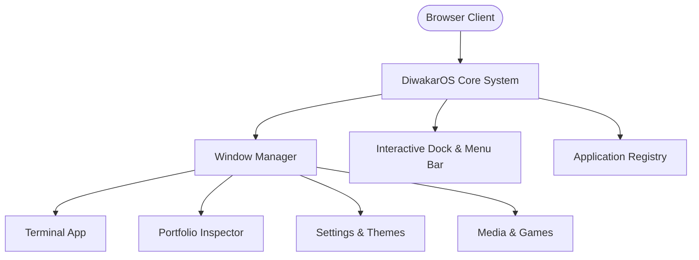

<div align="center">

# DiwakarOS

**The macOS-Desktop Experience in the Browser**

[](https://os.diwakaryadav.com.np/)
[](https://github.com/Diwak4r)
[](https://www.linkedin.com/in/diwak4r)
[](LICENSE)

</div>

---

### Overview

**DiwakarOS** is an interactive, web-based operating system designed to reimagine personal portfolio presentation. Built using **React**, **Next.js**, and **Tailwind CSS**, it simulates a desktop environment equipped with window management, application state persistence, and native-feeling UI interactions.

### System Architecture



### Core Features

- 🖥️ **Window Lifecycle Management:** Drag, resize, stack, minimize, and maximize application windows dynamically.
- 🌓 **Theme Engine:** Integrated dark/light mode toggle with native macOS translucent glassmorphism aesthetics.
- 🚀 **Performance Optimized:** Built with Next.js static asset optimizations for lightning-fast loads.

### Getting Started

```bash
# Clone repository
git clone https://github.com/Diwak4r/diwakaros.git

# Navigate & install
cd diwakaros
npm install

# Run dev server
npm run dev
```

---

<div align="center">
  <sub>Designed & Developed by <a href="https://github.com/Diwak4r">Diwakar Yadav</a></sub>
</div>
